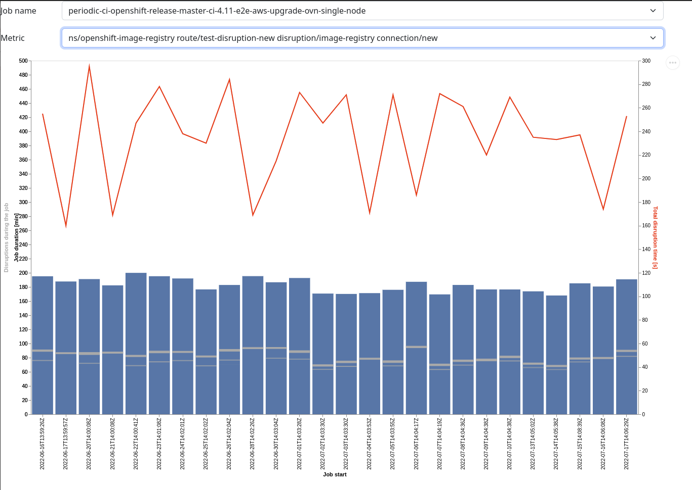

# Historical charts of E2E events

This repository contains rough proof of concept of a end-2-end events visualization across historical job runs (currently SNO 4.11 & SNO 4.11 upgrade).
For now it only presents disruptions only.

## Why

Plotting e2e events trends could be useful in pinpointing when some problems started to occur. 

## How it works

- Data for specific jobs is fetched from GCP Bucket containing job run artifacts and stored to `workdir/orig/` directory
- The data is processed into per job JSON file that stores all runs with all disruptions.
- Processed data is exposed via http endpoints:
  - `/jobs/` - list of jobs
  - `/job/NAME` - list of metrics available for that job
  - `/job/NAME/METRIC` - array of job runs and data for specific disruption (total run duration, total disruption duration, disruption intervals)
- `/` endpoint serves frontend file that fetches the data and presents a chart created with vega-lite specification

## Screenshot

